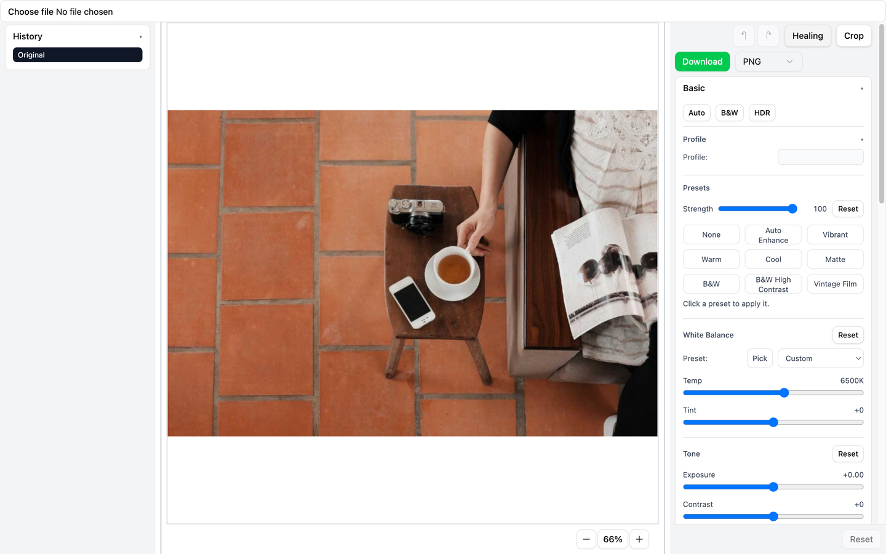
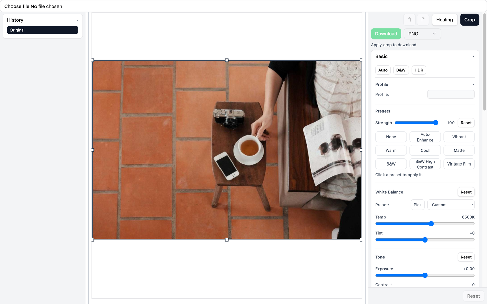
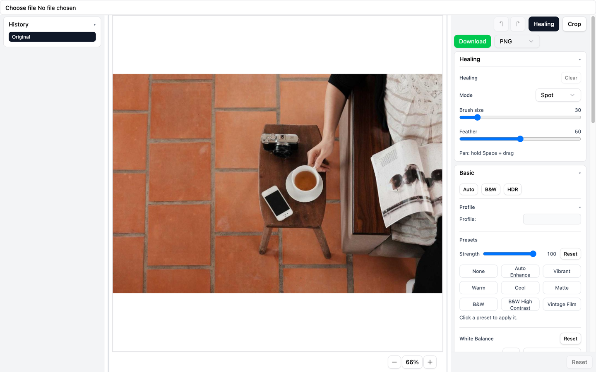

# React Image Editor

A Lightroom-style, non-destructive image editor for React, built on top of the HTML Canvas 2D API.

- Drop-in React component: pass an `imageSrc`
- Non-destructive pipeline: edits are re-applied from the original for preview + export
- Crop/straighten, healing, tone/color adjustments, history + undo/redo
- Export PNG/JPEG (with JPEG quality)

## Demo


<p>
  
</p>
<p>
  
</p>
<p>
  
</p>

## Features

- Viewer
  - Smooth zoom/pan (mouse wheel/trackpad + pinch zoom)
  - Inertial panning
  - Zoom controls + reset
- Crop & straighten
  - Aspect ratio presets + custom ratio
  - Aspect lock, constrain crop
  - Rotation/straighten controls
  - Apply crop and reset crop
- Adjustments (non-destructive)
  - White balance (temperature/tint + picker)
  - Tone (exposure/contrast/highlights/shadows/whites/blacks)
  - Color (vibrance/saturation)
  - Color mixer (per-band HSL) + point color picker
  - Tone curve (point + region/parametric)
  - Details (sharpening + denoise)
- Geometry & optics
  - Perspective controls
  - Lens distortion + chromatic aberration toggle
  - Vignette, grain, dehaze
- Healing
  - Spot / heal / clone modes
  - Brush size + feather
  - Clone source: hold `Alt/Option` and click to set (Clone mode)
  - Pan while healing: hold `Space` + drag
- History
  - Undo/redo + history list with time-travel (click an entry to jump)
- Export
  - Download as PNG/JPEG (JPEG quality control)
  - Export ignores zoom/pan (view-only)
  - Crop must be applied before export

## Install

```bash
npm install react-image-editor
```

Peer dependencies:

- `react`
- `react-dom`

## Quick Start

```tsx
import { useMemo, useState } from "react";
import { ReactImageEditor, type ImageEditorEdits } from "react-image-editor";

export function MyEditor() {
  const [file, setFile] = useState<File | null>(null);

  const imageSrc = useMemo(() => {
    if (!file) return null;
    return URL.createObjectURL(file);
  }, [file]);

  return (
    <div style={{ height: "100vh" }}>
      <input
        type="file"
        accept="image/*"
        onChange={(e) => setFile(e.target.files?.[0] ?? null)}
      />

      {imageSrc ? (
        <ReactImageEditor
          imageSrc={imageSrc}
          onEditsChange={(edits: ImageEditorEdits) => {
            // Persist edits in your app, sync to server, etc.
            console.log(edits);
          }}
        />
      ) : null}
    </div>
  );
}
```

## Component API

### `ReactImageEditor`

Props:

- `imageSrc: string`
  - URL to load into the editor (e.g. `URL.createObjectURL(file)` or a CDN URL).
- `onEditsChange?: (edits: ImageEditorEdits) => void`
  - Called when committed edits change (crop apply/reset, slider commits, healing ops, etc).

### `ImageEditorEdits`

`onEditsChange` emits a serializable snapshot of the editor state.

If you want to inspect the full shape, see `src/store/edits.ts`.

## Keyboard + Interaction Cheatsheet

- Undo / redo: `Cmd+Z`, `Shift+Cmd+Z`
- Zoom:
  - Mouse wheel / trackpad pinch over the canvas
  - Buttons: zoom in/out + reset
  - Keyboard: `Cmd/Ctrl +`, `Cmd/Ctrl -`, `Cmd/Ctrl 0`
- Crop:
  - Rotate: `[` / `]` (hold `Shift` for bigger step)
  - Reset rotation: `R`
- Healing:
  - Pan while healing: hold `Space` + drag
  - Clone source: hold `Alt/Option` and click (Clone mode)

## Styling / CSS

The editor UI is built with Tailwind CSS v4 + shadcn/ui components.

When consumed as a library you have two options:

1. Use Tailwind in your host app and allow the editor’s class names to be compiled.
2. Import a prebuilt CSS bundle shipped by the package (recommended for non-Tailwind hosts).

## CORS / Tainted Canvas Notes

If `imageSrc` points to a remote image without permissive CORS headers, the canvas can become tainted.
That breaks features that read pixels (eyedroppers) and can block export.

Recommendation: use same-origin images, or serve images with `Access-Control-Allow-Origin` and proper CORS configuration.

## Limitations

- State is managed with Zustand stores; multiple editors on the same page may conflict unless the library is adapted to use per-instance stores.

## Local Development (repo)

```bash
npm install
npm run dev
```

Other useful commands:

```bash
npm run build
npm run lint
npx vitest run
```

## Roadmap

See `ROADMAP.md`.
